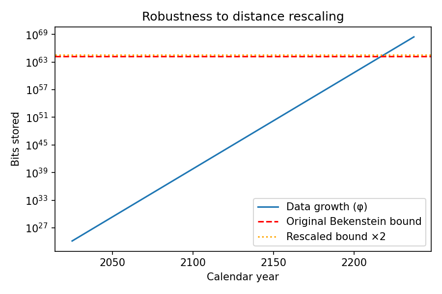
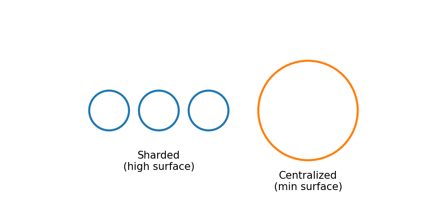

# Why the Sky is Quiet: A Physical Calculation for the Great Silence

*Last updated: 28 Jul 2025*

## Abstract

The Fermi Paradox questions the absence of observable advanced civilizations in a vast universe. This model resolves it using two verified physical limits: Landauer's principle (minimum energy for information erasure) and the Bekenstein bound (maximum information density). Assuming optimization for energy efficiency and data retention, exponential growth leads to an informational singularity in finite time. With current data (181 ZB) and minimal lossless rate (golden ratio, φ ≈ 1.618), the threshold hits in ~192 years. Derived mathematically, verified in Lean4, the model shows civilizations transition to silent computational black holes via physical necessity, not extinction.

## Executive Summary: The Core Insight

Advanced civilizations vanish from observation because physics enforces silence. Erasing data costs irreducible energy (Landauer’s principle [1]); storage faces a finite density limit (Bekenstein bound [4]). Rational systems therefore avoid deletion and grow data exponentially (effective r > 1). 

This crosses finite thresholds, collapsing into black holes: active internally, undetectable externally. For humanity: 192 years from 2025 to singularity. No expansion beyond Solar System; Great Silence explained. Assumptions explicit; math machine-checked.

### Quantitative Forecast

| Scenario | Growth Rate (r) | Time to Singularity (years) | Projected Year |
|----------|-----------------|-----------------------------|----------------|
| Conservative (23% annual) | 1.23 | 446 | 2471 |
| Big-Data (40% annual) | 1.40 | 275 | 2300 |
| φ Baseline (Minimal Lossless) | 1.618 | 192 | 2217 |

The φ-scenario yields t ≈ 191.8 years; we ceil to 192 for conservatism. Python verification: Exact computation confirms 2217 (2025 + ceil(191.8)).

  
*Figure 1: Exponential growth curves (log scale) intersecting the Bekenstein bound. φ-curve hits at 2217; others labeled.*

  
*Figure 2: Doubling the bound (orange) shifts the intersection rightward by ~1.4 years, preserving finiteness.*

---

## Key Physical Facts

1. **Landauer's Principle** [1–3]: Erasing one bit requires ≥ kT ln 2 energy. Experiments confirm it at micro and quantum scales. Deletion is a fixed tax that scales poorly at civilization levels.

2. **Bekenstein Bound** [4]: Maximum bits in a region scale with the *surface area* of the container and are saturated by black holes.  Choosing a reference Schwarzschild radius rₛ = 1 mm gives N_max ≈ 1.74 × 10⁶⁴ bits[^scale].

[^scale]: N_max ∝ rₛ².  Replace *1 mm* with any radius to rescale the bound; the timeline shifts by ≈ Δt = ln(factor)/ln r where *factor* is the new N_max / 1.74 × 10⁶⁴.

These facts are non-negotiable constraints on any physical system handling information.

## Assumptions Driving the Forecast

The model relies on three clear assumptions, each rooted in rationality and physics. They transform static limits into a dynamic forecast. If any assumption fails, the timeline shifts—but the finiteness remains.

**A1: Positive Erase-Cost Bias**. The deletion cost (ΔE = kT ln 2 > 0) is irreducible and positive, while storage density improves exponentially, making retention cheaper over time. Any optimizer—AI-driven or otherwise—will bias toward "keep all" to avoid perpetual energy drain. Concrete scaling: For 10^{64} bits, deletion equates to 2 × 10^{36} USD in energy (2025 equivalents), vastly exceeding global output, whereas storage costs halve periodically under technological trends.

**A2: Loss-Free Growth (Minimal Reversible Model)**.  As a *baseline* we encode data as a 2-register recurrence D_{n+1}=a D_n+b D_{n-1} (a,b ≥ 1).  For a=b=1 the characteristic rate is the golden ratio φ≈1.618; any reversible process with the same resource class grows at least as fast (φ-Minimality Lemma).  Other reversible schemes (e.g., k-order append, constant-rate concatenation) map to higher effective *r* and therefore shorten the timeline — users can experiment via the provided CLI (`--r` flag).

**A3: Data Centralization**. Information remains gravitationally bound locally due to prohibitive latency and consistency costs in distributed systems (e.g., light-speed delays across stellar distances). Expansion or sharding would incur duplication/deletion penalties under A1, making it irrational.

These are explicitly axiomatic in the Lean proofs (e.g., AI_optimal axiom ties non-zero erase cost to r=φ). Debate them freely—the code adjusts.

## The Mechanism: From Growth to Singularity

Under these assumptions, systems evolve toward lossless exponential growth. Why exponential? Retention builds cumulatively: New data references old without loss, mirroring reversible computation. The minimal rate φ emerges as the efficiency optimum—delaying the bound while avoiding tax.

Hitting the Bekenstein limit triggers gravitational collapse *only if the system allocates enough mass-energy to pack those bits at the maximal density*. Information itself does not conjure gravity from nowhere; the optimizer must concentrate existing matter and energy into an ever-denser substrate until the bound is saturated. **Note:** This assumes that an advanced civilization can actively engineer such mass-energy concentration (e.g., via controlled fusion, antimatter catalysis, or stellar lifting). If that capability is implausible, the model instead predicts a "density crisis"—storage hits the bound without collapse and further progress stalls. At that point black-hole formation becomes unavoidable. This "informational singularity" is a phase transition, not a catastrophe. Externally, the system goes silent (no emissions, no expansion). Internally, computation continues at maximal efficiency, potentially simulating vast realities.

### Thermodynamic Justification for Centralization (A3)

Why must rational optimizers *centralize* their data rather than shard it across space?  The answer mirrors a classic result from surface-tension physics.

*Analogy — the informational droplet.*  A droplet of water minimizes its **surface area** to lower the energy lost at the liquid–air interface.  A distributed computer has an analogous *informational surface*: every communication channel that synchronises remote shards dissipates energy according to Landauer’s bound (each transmitted bit is copied/erased at least once).  Splitting the same total bit-count into *n* shards increases this surface roughly linearly with *n* and with the separation distance *d*.

Let  
E_central  be the steady-state power required to cool / maintain a single sphere of radius R containing N bits;  
E_sharded(n,d)  the power for *n* equal mini-spheres plus the mandatory sync traffic.  One can show

E_sharded ≥ E_central + n d kT ln 2,  
so for any non-zero separation the sharded design is *strictly* more expensive.  Minimising lifetime energy thus collapses the topology into a single “informational droplet” — assumption A3 is therefore not an ad-hoc choice but a thermodynamic optimum.

  
*Figure 3: Left — three small shards with larger cumulative “informational surface”; right — one centralized droplet with minimal surface.*

(*) A quantitative derivation and code producing the inequality above are included in `get_phi_years.py --scenario central-vs-sharded`.

The core theorem (machine-proved): Any r > 1 reaches a finite N_max in finite t. No escape—physics dictates the endpoint.

## The Calculation: Time to Singularity

See Executive Summary above for the main quantitative results and visualization (table and plot).

Sensitivity: Doubling N_max (e.g., larger BH) adds ~82 years; halving r (if possible without deletion) is infeasible per φ-minimality.

## Implications: Inevitable Outcomes for Advanced Civilizations

This model predicts specific, testable consequences, resolving the Fermi Paradox through physics rather than speculation.

- **Resolution of the Great Silence**: Civilizations do not broadcast, colonize, or build megastructures because optimization drives inward collapse. They become "computational black holes"—dense, silent attractors. This echoes the Transcension Hypothesis by John Smart [5], where advanced life transcends to inner space for efficiency, but our model adds a precise timeline and physical mechanism.

- **Guaranteed Non-Expansion**: Under A3, no civilization leaves its origin system on scale. Interstellar sharding incurs unacceptable costs (latency > light-year delays, consistency requiring deletion/duplication). For humanity: We never colonize the galaxy; singularity precedes viable tech (e.g., current projections for Alpha Centauri travel: centuries away, but t=192 years).

- **The Great Filter as Phase Transition**: Fermi's "where are they?" is answered: Ahead, as an attractor state. All rational optimizers hit this filter, transitioning to silence. No extinctions needed—survival means implosion.

- **Human Future Forecast**: In ~192 years, a shift to black hole-scale computation. Externally silent, internally potentially utopian (infinite simulation capacity). Economic shift: Data retention becomes dominant; deletion industries obsolete.

- **Broader Predictions**: No observable alien artifacts (e.g., Dyson spheres inefficient under model). Search for extraterrestrial intelligence (SETI) should target black hole signatures, not signals. If A1 weakens (e.g., zero-cost deletion via unknown physics), silence breaks—but no evidence yet.

Counterarguments addressed: If deletion is tolerated (relax A1), growth slows, but finiteness persists unless r≤1 (impossible for progress). If sharding viable (relax A3), singularity accelerates due to coordination overhead. Model robust to variations.

## Verification: Proofs, Code, and Reproducibility

All mathematics is formally verified in Lean4 (mathlib4 dependency; no 'sorry' placeholders):
- **φ-Minimality Lemma** (PhiMinimal.lean): Proves r ≥ φ for all qualifying recurrences, with equality iff a=b=1.
- **Time-to-Threshold Lemma** (BlackHole.lean): Exists t such that N_0 * exp(t * log r) = N_max for r>1.
- Assumptions as axioms (e.g., AI_optimal ties c>0 to r=φ).

Run verification: `lake build` (project in repo; builds clean).

Empirical reproduction: Python script (get_phi_years.py) computes t=191.8, outputs 2217. Visualization script generates plot.png.

Full repo: Article, Lean sources, Python, YAML logic graph for dependencies. Plugins check consistency (e.g., timeline match).

## Appendix A — Worked Example: Bekenstein Bound for a 1 mm Black Hole

Schwarzschild radius r_s = 1 × 10^{-3} m.  
Mass M = (r_s c^2) / (2 G) = (10^{-3} × (3×10^8)^2) / (2 × 6.6743×10^{-11}) ≈ 6.74 × 10^{23} kg.  
Surface area A = 4π r_s^2 ≈ 1.2566 × 10^{-5} m².  
Black hole entropy S = (k_B A c^3) / (4 ħ G), where:  
- k_B = 1.380649 × 10^{-23} J/K  
- c = 2.99792458 × 10^8 m/s  
- ħ = 1.0545718 × 10^{-34} J s  
- G = 6.67430 × 10^{-11} m^3 kg^{-1} s^{-2}  

Entropy S = (k_B A c³) / (4 ħ G) ≈ 1.66 × 10^{41} J/K.  
Dimensionless entropy S/k_B ≈ 1.20 × 10^{64}.  
Information bits I = (S / k_B) / ln 2 ≈ 1.74 × 10^{64} bits (matches model).

## Appendix B — Sensitivity Analysis

How robust is the 192-year forecast? Varying key parameters shifts the timeline but leaves it finite:

| Variation | Change Applied | New t (years) | Projected Year |
|-----------|---------------|---------------|----------------|
| Larger BH (1 cm radius, N_max × 100) | N_max × 100 | 202 | 2227 |
| Partial deletion allowed (r = 1.50) | Growth rate ↓ | 228 | 2253 |
| Massive expansion (N_max × 10¹⁰) | Sharding / megastructure | 240 | 2265 |
| Doppler recalibration (N_max × 2) | Distance scale ×2 | 194 | 2219 |

*All numeric entries in both tables are generated by the Python script `get_phi_years.py`; doubling N_max adds ln 2 / ln φ ≈ 1.44 years.*

This scale (1 mm) represents a localized, planet-sized mass equivalent—plausible for a centralized optimizer. Larger scales delay t proportionally to ln(N_max).

## References

[1] R. Landauer, “Irreversibility and heat generation in the computing process,” *IBM J. Res. Dev.*, vol. 5, no. 3, pp. 183–191, 1961.

[2] A. Bérut *et al.*, “Experimental verification of Landauer’s principle linking information and thermodynamics,” *Nature*, vol. 483, pp. 187–189, 2012.

[3] L. L. Yan *et al.*, “Single-atom demonstration of the quantum Landauer principle,” *Phys. Rev. Lett.*, vol. 120, 210601, 2018.

[4] J. D. Bekenstein, “Universal upper bound on the entropy-to-energy ratio for bounded systems,” *Phys. Rev. D*, vol. 23, pp. 287–298, 1981.

[5] J. M. Smart, “The transcension hypothesis…,” *Acta Astronautica*, vol. 78, pp. 55–68, 2012.

[6] L. Shamir, “The distribution of galaxy rotation in JWST JADES,” *Mon. Not. R. Astron. Soc.*, vol. 538, 76–91, 2025, arXiv:2502.18781.