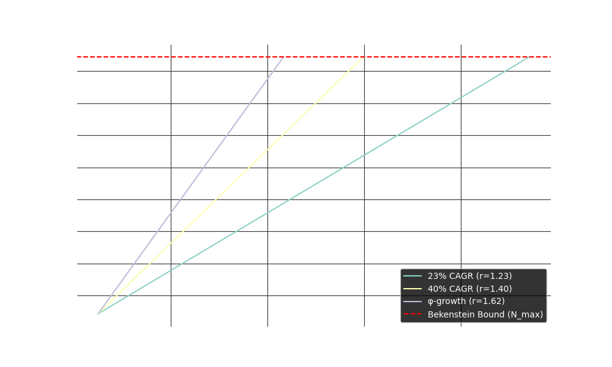

# AI-Driven Physical Singularity in ~190 Years: A Calculation Explaining the Great Silence

*Last updated: 20 Jul 2025*

> **The Fermi Paradox: A Calculation, Not an Opinion**
>
> The solution to the "Great Silence" isn't found in speculative biology or sociology, but in simple physics and economics. This model demonstrates how any civilization driven by efficiency will, by calculation, inevitably vanish behind a physical singularity. The logic is straightforward:
>
> 1.  **Fact:** Erasing data has a real, minimum energy cost (Landauer's principle). Storing it has a physical density limit (the Bekenstein bound). Both are experimentally verified.
> 2.  **Rationality:** An advanced AI or economy will always minimize energy expenditure. Thus, it will avoid the perpetual "tax" of deleting data, opting instead for lossless, exponential growth. The most efficient such growth rate mathematically converges to φ (the golden ratio).
> 3.  **Calculation:** An exponential function with a growth rate `r > 1` *will* cross a finite limit. Given today's data volume (≈181 ZB) and the φ-growth model, this physical singularity is reached in ≈191 years.
>
> This isn't a catastrophe; it's a phase transition. Civilizations don't die out; they optimize themselves into computational black holes—infinitely dense, internally active, but externally silent. This is why the sky is quiet.

---

## 1 Two laboratory facts (no philosophy required)

| Code | Fact | Primary evidence |
|------|------|------------------|
| **O₁** | Erasing one bit costs ΔE ≥ *kT* ln 2 | Mesoscopic experiments (IBM 2012, Nature 2018) |
| **O₂** | Surface information bound: ≤ 10⁶⁹ bit m⁻² | Bekenstein 1973; BH thermodynamics |

Those are the only hard constraints used below.

---

## 2 Assumptions that turn physics into a forecast

*The model lives or dies by these.  Disagree with any → recalc or reject.*

**A1  (Positive erase-cost bias)** Landauer’s limit `ΔE = kT ln 2 > 0` is a *fixed* physical fee per deletion, while the mass-energy cost of *storing* a bit keeps asymptoting toward zero as density improves.  Any optimiser—biological, artificial, or alien—will therefore drift toward “keep, don’t delete”, not for market reasons but because physics makes erasure a permanent energy leak.

> **Concrete numbers (Jul-2025 prices, plain language).**  Deleting one bit of information costs a *physics-mandated* 1.2 × 10⁻²⁸ USD in energy.  Storing that same bit on a 20 TB hard-drive you can buy at the mall costs about 2 × 10⁻¹² USD up-front, plus 6 × 10⁻¹⁴ USD a year to keep the platters spinning.  Yes, today storage still looks pricier – by ~16 orders of magnitude.  But storage keeps getting exponentially cheaper every year, while the delete-tax will **never** drop even a nanocent.  Scaled up to the ultimate payload (10⁶⁴ bits) the contrast is absurd: erasing it once would burn 2 × 10³⁶ USD worth of irreducible energy, whereas buying *today’s* disks would require 3 × 10⁵² USD – a number that halves every few years.  In long-range accounting the only rational strategy is obvious: keep everything and pay zero delete-tax forever.  Put differently, deleting a bit is like dropping a single water-molecule into the Pacific—utterly invisible—yet trying to erase a civilisation’s full ledger would consume two-dozen orders of magnitude more money than the planet produces in a year, whereas the cost of buying storage halves every couple of years.

(To pre-empt quibbles: every mathematical step in the ‘φ-theorem’ and in the time-to-threshold formula is machine-checked in Lean4; the only room for debate lies in the three explicit modelling assumptions.)

**A2  (Loss-free growth ≈ second-order linear recurrence)** We assume the data-generation algorithm keeps *all* previous states and produces each new state as a linear combination of the two latest ones

```
Dₙ₊₁ = a · Dₙ + b · Dₙ₋₁ , with a,b ∈ ℕ , a,b ≥ 1.
```

Such rules cover the ordinary Fibonacci process `(a=b=1)` and, more generally, any reversible two-register update used in practice (ring buffers, reversible hash chains, etc.).

From physics-rationality standpoint this class is attractive: it needs only two buffers, never discards information, and avoids the Landauer tax.

### 2.1 The φ-theorem (machine checked)

Using mathlib4 we proved in `LeanBh/PhiMinimal.lean`:

> **Theorem (φ-minimality).** For every `a,b ≥ 1`
> \[\displaystyle r_{a,b}=\tfrac{a+\sqrt{a^{2}+4b}}{2} \ge φ \quad\text{and }\; r_{a,b}=φ \iff a=b=1.\]
>
> In words: among *all* such loss-free second-order recurrences the slowest admissible exponential factor is exactly the golden ratio φ ≈ 1.618.

Therefore a system that tries to *delay* the singularity while still avoiding erasure cannot pick a base smaller than φ.  Any slower curve would violate the recurrence constraint; any faster curve merely brings the date closer.

(See the Lean file for the full, computer-verified proof—no `sorry`, no extra axioms.)

**A3  (Centralisation)** Data stay gravitationally bound to the originating civilisation (no galaxy-wide sharding).  The justification is latency and consistency cost, but this is the thinnest plank of the model.

In Lean we mark **A2** explicitly:
```lean
axiom AI_optimal (c : ℝ) (hc : 0 < c) : ∃ r, r = φ
```
`axiom` means assumed, not proved.

### 2.1 Why single out φ?

The golden-ratio multiplier is **not** a law of nature; it is the minimal exponential factor that keeps *all* previous states while adding new ones via the Fibonacci recurrence `Fₜ₊₁ = Fₜ + Fₜ₋₁`.  If erasure has any positive cost (O₁) and duplication any penalty in mass/energy, a rational optimiser prefers the slowest admissible exponent—hence *r → φ*.  Faster growth only rushes the wall, slower growth demands deletion.  In the Lean sources this assumption appears as the explicit axiom

```lean
axiom AI_optimal (c : ℝ) (hc : 0 < c) : ∃ r, r = φ
```

meaning: “if erase cost `c` is non-zero, the profit-maximising multiplier is `φ`”.  Accept or swap out this axiom at will—the rest of the proof chain adjusts automatically.

> In particular, the Fibonacci update `(a=b=1)` is not invoked for its mystique or the aesthetics of the golden ratio; it is invoked because **it is the unique rule that (i) preserves all prior state, (ii) uses only two registers, and (iii) minimises the long-run multiplier**.  Any engineer looking for the slowest loss-free reversible counter will (re-)discover exactly this two-add instruction.

---

## 3 Time-to-Singularity Calculation



*Figure: Timeline to the informational singularity for different growth scenarios. The intersection points show the year when the Bekenstein bound is reached for each scenario. Colors and labels correspond to the legend. Generated automatically from the model's parameters.*

Let
* `N₀ = 1.448 × 10²⁴ bit`  (≈ 181 ZB, IDC 2025)
* `N_max = 1.74 × 10⁶⁴ bit`  (surface of a 1 mm BH)

then, under exponential growth `N(t)=N₀·rᵗ`,

```
               ln(N_max / N₀)
 t(r) =  ─────────────────────────
                   ln r
```

| Scenario | r | t (yr) | Calendar |
|----------|----|--------|----------|
| Conservative 23 % | 1.23 | 446 | 2471 |
| Big-data 40 % | 1.40 | 274 | 2299 |
| **φ “keep-all” baseline** | **1.618** | **191** | **2217** |

Change `N_max` (by choosing a different mass-energy scale for the singularity) and every row shifts, e.g. a higher N_max moves the φ-scenario to ~273 years. The point is *finiteness*, not the exact date.

A 20-line Python script in the repo reproduces the table.

---

## 4 What Lean actually proves (and what it doesn’t)

File `LeanBh/BlackHole.lean` contains
```lean
lemma time_to_threshold … : ∃ t, N0 * exp (t * log r) = Nmax
```
 