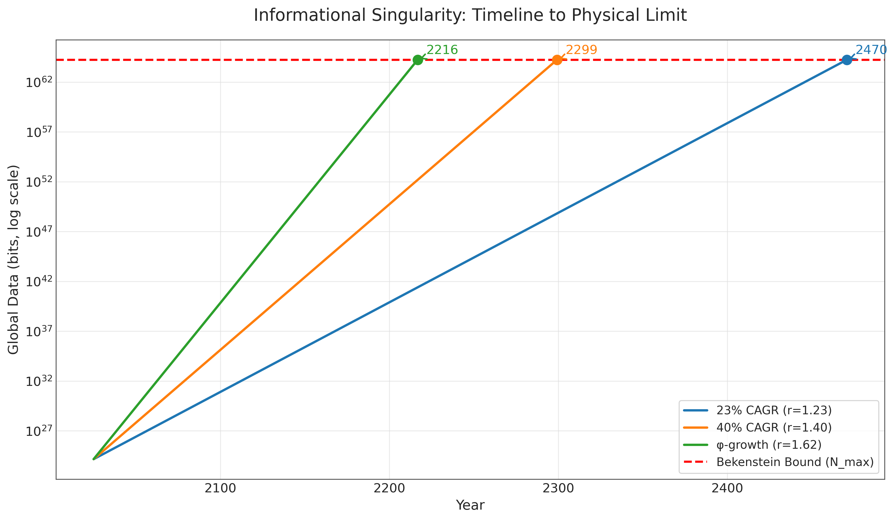
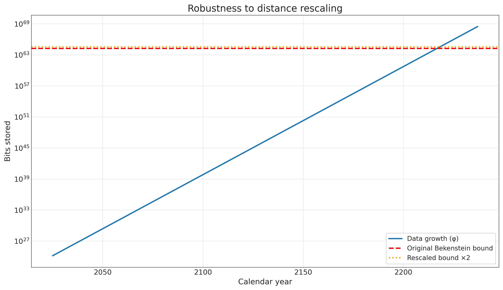

# Informational Black Holes:\\ The Physical Resolution to the Fermi Paradox

*Last updated: <!--VALUE:last_updated-->07 Aug 2025<!--END:last_updated-->*

## Abstract

The Fermi Paradox questions the absence of observable advanced negentropic systems (entities (biological, artificial, or otherwise) that sustain themselves by locally reducing entropy and creating information) in a vast universe. This paper proposes a resolution using two verified physical limits: Landauer's principle (minimum energy for information erasure) and the Bekenstein bound (maximum information density). Geometric proof shows finite-time silence as unavoidable for any physical system with r > 1. Systems with r ≤ 1 yield silence by definition. Any non-stagnant negentropic system (effective information growth r > 1) reaches an informational singularity in finite time, transitioning to silent, information-saturated states. Given today's global data volume (~<!--VALUE:global_data_zb-->181<!--END:global_data_zb--> ZB per 2025 forecast [7]) and a minimal loss-free growth rate (golden ratio φ ≈ <!--VALUE:phi_value:float3-->1.618<!--END:phi_value-->), the threshold arrives in ≈ <!--VALUE:phi_baseline_years-->192<!--END:phi_baseline_years--> years. Derived mathematically and verified in Lean4, the model shows silence as a physical necessity under the stated assumptions, not extinction. Model robust to variations, consistent with JWST observations: No 'young' expanding civilizations visible, as growth phase is brief (~decades to centuries) before silence.

## Definitions & Scope

**Negentropic node:** a biological, artificial, or hybrid system that keeps itself organised by locally lowering entropy and accumulating information.  The growth factor **r** is the long-term multiplier of stored bits per year.

**Growth regimes**

Regression (r < 1) and stagnation (r = 1) are silent by definition. These systems shed or freeze information and stay invisible. Expansion (r > 1) is the only regime that could produce observable signals. It must eventually confront the Landauer and Bekenstein limits.

Physiology or culture do not matter: the paper speaks only about **r** and physical constraints.

Two energy-optimal behaviours follow:

**Integrators** minimise communication surface, pull mass and data inward, and reach the Bekenstein bound first. Collapse or a silent, saturated state follows.

**Spreaders** send out minimalist probes that replicate but do not maintain global coherence. Probes may spread, but without sync, they're disconnected systems - each collapses silently. Visible events (launches) are rare and short-lived before economics prohibits them. Their beamed signals are sparse and quickly drown in background noise.

Either path ends in observational silence. Which one dominates makes no difference to the Paradox.

## Executive Summary

**Key idea.** Advanced negentropic nodes disappear from view not by dying out, but by condensing into ultra-compact, information-dense objects. This provides a physical resolution - not just a speculative answer - to the Great Silence.

**Why it is inevitable.**
• Erasing information demands energy (Landauer's principle [1-3]).
• Storing information faces a finite surface-area limit (Bekenstein bound [4]).
• Any system with net positive information growth (r > 1) therefore hits that limit in finite time.

**What happens next.** Exceeding the information-density bound forces negentropic nodes toward maximal-density configurations with external silence. In extreme regimes this aligns with gravitational collapse; в любом случае наблюдаемая подпись — тишина. An illustrative φ-baseline places humanity ~192 years from the threshold; code explores parameter ranges.

### Quantitative Forecast (Illustrative)

| Scenario | Annual Growth (r) | Years Until Singularity | Year Reached |
|:-------------------------|:-----------------|:---------------------------|:---------------|
| Conservative (23% annual) | <!--VALUE:conservative_r:float2-->1.23<!--END:conservative_r--> | <!--VALUE:conservative_years-->446<!--END:conservative_years--> | <!--VALUE:conservative_year-->2471<!--END:conservative_year--> |
| Big-Data (40% annual) | <!--VALUE:big_data_r:float2-->1.40<!--END:big_data_r--> | <!--VALUE:big_data_years-->275<!--END:big_data_years--> | <!--VALUE:big_data_year-->2300<!--END:big_data_year--> |
| φ Baseline (Minimal Lossless) | <!--VALUE:phi_baseline_r:float3-->1.618<!--END:phi_baseline_r--> | <!--VALUE:phi_baseline_years-->192<!--END:phi_baseline_years--> | <!--VALUE:phi_baseline_year-->2217<!--END:phi_baseline_year--> |

The φ-scenario yields t ≈ <!--VALUE:phi_t_precise:float1-->191.8<!--END:phi_t_precise--> years. We round this up to <!--VALUE:phi_baseline_years-->192<!--END:phi_baseline_years--> for conservatism. Python verification confirms <!--VALUE:phi_baseline_year-->2217<!--END:phi_baseline_year--> (2025 + ceil <!--VALUE:phi_t_precise:float1-->191.8<!--END:phi_t_precise-->).

*Figure 1 - Exponential data-growth curves (log scale) intersect the finite Bekenstein bound. The φ-trajectory crosses at <!--VALUE:phi_baseline_year-->2217<!--END:phi_baseline_year--> CE. Conservative and big-data scenarios follow.*

*Figure 2 - Doubling the information bound delays the intersection by ≈1.44 years. Finiteness is unaffected.*

*Figure 3 - Regardless of growth rate, every pathway culminates in observational silence.*

---

## Key Physical Facts

**Landauer's Principle** [1-3]: 
Erasing one bit requires $\geq kT \ln 2$ energy. Verified experimentally at classical and quantum scales. Implication: Deletion is a fixed tax that scales poorly at planetary or higher technological scales.

**Bekenstein Bound** [4]: 
Maximum bits in a region scale with the surface area of the container and are saturated by black holes. For reference Schwarzschild radius $r_s = 1$ mm, $N_{\text{max}} \approx 1.74 \times 10^{64}$ bits. $N_{\text{max}} \propto r_s^2$. Rescaling shifts timelines by $\Delta t = \ln(\text{factor})/\ln r$. Finiteness is preserved.

These facts are non-negotiable constraints on any physical information-handling system.

## Information Economics: Three Physical Arguments

The physics of information processing creates three economic forces that drive negentropic systems toward local concentration and external silence. Each argument reinforces the others, showing that for any growth rate r > 1, physical constraints - not rational choice - make interstellar transmission impossible while local storage becomes mandatory.

### The Storage/Deletion Crossover

Landauer's principle sets a fixed energy floor for deleting information, while storage costs decrease exponentially with technology. This creates a crossover point where keeping data becomes physically cheaper than erasing it.

<!--TABLE:storage_simple-->
| Year | StoreUSD/GB | DeleteUSD/GB | Cheaper | Factor |
|---|---|---|---|---|
| 2025 | 0.16 | ~6e-19 | Delete | 2.51e+17 |
| 2075 | 4.8e-09 | ~6e-19 | Delete | 7.47e+09 |
| 2125 | ~1e-16 | ~6e-19 | Delete | 2.23e+02 |
| 2217 | ~2e-30 | ~6e-19 | Store | 3.16e+11 |
<!--END:storage_simple-->

**Physical consequence:** Around <!--VALUE:crossover_year-->2141<!--END:crossover_year-->, storing information becomes cheaper than deleting it for the first time in history. This isn't an economic choice - it's a thermodynamic necessity. Systems must hoard data to minimize energy expenditure, accelerating the approach to information density limits. The crossover occurs decades before the singularity (<!--VALUE:phi_baseline_year-->2217<!--END:phi_baseline_year-->), ensuring that negentropic nodes become information accumulators by physical law well before reaching the Bekenstein bound.

### The Thermodynamics of Interstellar Travel

Transmitting information across interstellar distances faces insurmountable energy barriers that worsen exponentially as storage becomes cheaper.

**Energy analysis for 1 TB to Proxima Centauri (4.2 ly):** (illustrative baseline; ranges handled in code)
Minimum transmission energy requires ~$4.5 \times 10^{14}$ J, costing ~$<!--VALUE:probe_energy_cost:sci-->1.2e+07<!--END:probe_energy_cost--> USD at current energy prices (~$<!--VALUE:probe_bit_cost:currency-->0.0000015625<!--END:probe_bit_cost--> USD per bit).

**Comparison with local storage:**
In 2025, transmission costs <!--VALUE:trans_2025_ratio:float1-->1.8<!--END:trans_2025_ratio-->× more than storage. By 2075, transmission costs <!--VALUE:trans_2075_ratio:big-->53,000,000<!--END:trans_2075_ratio-->× more than storage. By 2125, transmission costs <!--VALUE:trans_2125_ratio:sci-->1.6e+15<!--END:trans_2125_ratio-->× more than storage.

**Physical consequence:** By 2075, interstellar transmission becomes экспоненциально менее эффективной, чем хранение, при реалистичных параметрах. Энергия на один бит сопоставима с энергией хранения миллионов–триллионов бит локально. Это отражает фундаментальные энергетические ограничения каналов, а не только экономику.

### Opportunity Cost: The Final Argument

The ultimate measure: for the same energy budget, how much information can you store versus transmit?

**Energy tradeoffs by era:**

**2025:** With $1 of energy, you can store <!--VALUE:store_2025_bits:big-->500,000,000,000<!--END:store_2025_bits--> bits locally, send 64 million bits to Mars, or send <!--VALUE:prox_send_bits:big-->640000<!--END:prox_send_bits--> bits to Proxima Centauri.

**2075:** The gap widens dramatically. The same $1 stores <!--VALUE:store_2075_bits:sci-->1.7e+19<!--END:store_2075_bits--> bits locally but still sends only <!--VALUE:prox_send_bits:big-->640000<!--END:prox_send_bits--> bits to Proxima - a <!--VALUE:opp_2075_advantage:big-->27,000,000<!--END:opp_2075_advantage-->-fold advantage for local storage.

**2125:** Local storage becomes absurdly superior. $1 stores <!--VALUE:store_2125_bits:sci-->5.6e+23<!--END:store_2125_bits--> bits locally versus <!--VALUE:prox_send_bits:big-->640000<!--END:prox_send_bits--> bits to Proxima - nearly a <!--VALUE:opp_2125_advantage:big-->1,000,000,000<!--END:opp_2125_advantage-->-fold difference per bit transmitted.

**2217 (Singularity):** The final state shows complete transmission impossibility. $1 stores $4 \times 10^{40}$ bits locally - more than all information that has ever existed - while interstellar transmission remains fixed at <!--VALUE:prox_send_bits:big-->640000<!--END:prox_send_bits--> bits.

**Physical consequence:** By 2125, the same energy that transmits one bit to Proxima could store <!--VALUE:opportunity_2125_ratio:sci-->1.2e+11<!--END:opportunity_2125_ratio--> bits locally. This represents a fundamental physical barrier making transmission physically impossible for any system operating near thermodynamic limits.

## Minimal Negentropy Principle: Why Growth Occurs

The proposed resolution frames on one minimal principle rooted in basic thermodynamics:

**P1: Local Negentropy.** Any non-stagnant, non-regressing negentropic node has effective average information growth r > 1 over long timescales.

This follows from the observational framing of the Fermi Paradox: we look for detectable information-processing nodes, which presupposes growth (r > 1). Stagnation (r = 1) or regression (r < 1) naturally yields silence through resource decay, so rejecting P1 implies negentropic nodes never grow enough to be observable - a trivial resolution.

**Note on reversible/adiabatic computing:** Practical computation and communication include irreversibilities (error correction, control, I/O), so the Landauer floor remains relevant at scale. Even with aggressive reversibility, any net growth r > 1 preserves the theorem; reversibility stretches timelines only logarithmically.

## Why Informational Growth Leads to Black Holes

Negentropic systems with r > 1 evolve toward exponential information growth to minimise erasure costs (Landauer's principle). Hitting the Bekenstein limit triggers a density crisis: To continue, the system must pack bits at maximal density, requiring mass-energy concentration. This dynamic potentially leading to collapse, or to stagnation if not (both outcomes are externally silent).

The "informational singularity" is a phase transition. Externally, there are no emissions or expansion.

### Why Negentropic Systems Don't Expand Across Space

Why no sharding or interstellar spread? Surface-tension physics explains why sharding is energetically prohibitive, even without synchronization. Capacity/SNR limits of interstellar channels further suppress viable throughput versus local storage.

*Informational droplet.* Water droplets minimize surface area to reduce energy loss. Distributed information has an "informational surface": Communication channels dissipate energy per Landauer (transmitted bits copied/erased). Sharding into n nodes at distance d increases surface ~ n d, raising costs.

$E_{\text{sharded}} \geq E_{\text{central}} + n d kT \ln 2$ (for sync traffic). Non-zero d makes sharding strictly more expensive, favoring local centralization. Energy inequality verified computationally (see get_phi_years.py --compare-sharded).

**Unsynced sharding objection:** Even without synchronization, sharding creates independent nodes, each inheriting r > 1 and hitting the Bekenstein bound independently, becoming silent mini-black-holes. No coherent galactic expansion - signals from rare probes drown in cosmic noise (e.g., pencil-beams undetectable beyond ~10 ly). Von Neumann probes become energetically unfavorable by ~2075 even with optimistic technological improvements (per Information Economics). If launched earlier, their signals are too weak and noisy for detection across interstellar distances.

*Figure 4 - Sharding increases "informational surface" and dissipation. Centralisation minimises it.*

## The Core Theorem: Finite-Time Singularity

From facts and principle follows the theorem: Any r > 1 reaches finite N_max in finite t (machine-proved in Lean4, see BlackHole.lean in repository).

**Proof intuition:** On a log scale, exponential growth is an upward line while the bound is horizontal. Non-parallel lines intersect - a geometric inevitability.

**Mathematical proof:** Time to bound $t = \ln(N_{\text{max}} / N_0) / \ln(r)$. For $r > 1$, $\ln(r) > 0$, so $t$ is finite and positive (given $N_{\text{max}} > N_0$). Example: Even minimal growth r = 1.0001 gives t ≈ <!--VALUE:minimal_growth_years:big-->922918<!--END:minimal_growth_years--> years - long but finite. For $r = 1$, $\ln(r) = 0 \rightarrow$ division by zero, infinite $t$ (never hits bound, but silent by definition). Proved rigorously in Lean4. Geometric view: On semi-log plot, growth is a line with slope $\ln(r) > 0 \rightarrow$ must intersect horizontal bound line.

**Physical consequence:** No system can maintain observable growth indefinitely. Either it grows (r > 1) and hits limits in finite time, or it stagnates (r ≤ 1) and becomes undetectable. Both paths lead to observational silence.

## Illustrative Calculation: Time to Singularity

For illustration under a minimal loss-free growth baseline (φ-rate), see the forecast table and figures above.

Sensitivity (Appendix B): All parameter variations shift timelines slightly but preserve the inevitability of finite-time collapse.

## Implications

The theorem reframes the Fermi question from "Where is everybody?" to a purely physical one: "How do information-growing systems minimise energy?" Either of the two optimal behaviours defined above yields observational silence.

**This reframes Fermi as a theorem:** In a universe with Landauer and Bekenstein limits, observable growth (r > 1) self-terminates into silence. Non-growth (r ≤ 1) never becomes observable. No extinctions, wars, or choices needed - this is thermodynamics + geometry, not opinion. Observable growth self-terminates, non-growth never manifests. Critics may argue partial deletion avoids bounds, but even r = 1.5 delays by only logarithmic factors (Appendix B). The endpoint remains finite. Systems that "forget noise" to stabilize information achieve effective r = 1 (stagnation) and become silent by definition. But any net growth, however minimal, triggers the theorem.

### Quick Q&A

**Why no visible Dyson spheres or probes?**  
Interstellar transmission becomes thermodynamically prohibited post-2075 (Information Economics section). Von Neumann probes: Even if launched earlier, signals too weak/noisy for detection. Spreaders may launch tiny probes, but their pencil-beam signals hide in cosmic noise. Integrators collapse locally. Either way, sky remains silent.

**Isn't "black hole as computer" too speculative?**  
Internal computation is hypothetical¹ - but irrelevant. The theorem proves external silence from density crisis alone, regardless of internal dynamics. Focus: Bekenstein limit forcing phase transition to undetectable state. No need to assume "programming". Collapse forced by physical bounds.

**How does this differ from Hawking's black hole information paradox?**  
Hawking's paradox concerns quantum information loss during black hole evaporation - a microscopic quantum effect. Our theorem addresses macroscopic civilization-scale information accumulation that forces gravitational collapse, not evaporation. The scales and physics are entirely different: we focus on information density driving collapse, not information loss during decay.

**Are definitions of "civilization" and "progress" still anthropocentric?**  
No. Text uses only "negentropic node" and coefficient **r**. Anything that doesn't grow (r ≤ 1) is silent by definition, making the paradox disappear. Physiology, culture, intelligence irrelevant - only thermodynamics matters.

**Isn't 192 years too precise?**  
It's an illustrative baseline. The theorem asserts only finite t. Even ten-fold parameter changes shift dates logarithmically, not eliminating the bound. All parameters are adjustable in the code. Core result: finite-time silence for any r > 1.

¹*Speculative, but irrelevant - external silence from bounds is certain per theorem.*

---

## Verification: Proofs, Code, Reproducibility

**Mathematical Verification:** Core theorem formally proven in Lean 4 proof assistant (no axioms, no 'sorry's):
- φ-Minimality: r ≥ φ for lossless baselines (PhiMinimal.lean)
- Time-to-Threshold: Finite t for r > 1 (BlackHole.lean)

**Computational Verification:** All calculations reproduce tables and figures programmatically (get_phi_years.py, opportunity_bits.py). Automated consistency checks ensure synchronization between proofs, code, and article content.

**Complete Reproducibility:** All source code, formal proofs, and verification pipeline available at <!--VALUE:repo_short-->github.com/DanielSwift1992/veritas-black-hole-article<!--END:repo_short-->. Run `lake build` to verify Lean proofs, `python get_phi_years.py` to reproduce all timeline calculations.

**Note:** This work represents independent research exploring a novel thermodynamic approach to the Fermi Paradox. While the mathematical framework is rigorous, certain interpretive elements (e.g., civilization-to-black-hole transitions) remain speculative. The author welcomes feedback, extensions (e.g., quantum considerations), and collaborative refinement of these ideas.

## Appendix A: Bekenstein Bound Example (1 mm Black Hole)

$r_s = 10^{-3}$ m

$M = \frac{r_s c^2}{2G} \approx 6.74 \times 10^{23}$ kg

$A = 4\pi r_s^2 \approx 1.2566 \times 10^{-5}$ m²

$S = \frac{k_B A c^3}{4 \hbar G} \approx 1.66 \times 10^{41}$ J/K

$\text{Bits} = \frac{S/k_B}{\ln 2} \approx 1.74 \times 10^{64}$

## Appendix B: Sensitivity Analysis

Robustness: All parameter variations alter timelines by at most logarithmic factors, yet finite-time collapse remains unavoidable.

**Note on rarity:** If life is rare (e.g., abiogenesis as a Great Filter), this complements rather than weakens the model. Rare emergence + inevitable silence = consistent with observations. The theorem applies to any negentropic system that does emerge, regardless of frequency.

| Variation | Change | t (years) | Year |
|:----------------------------------------|:---------------|:-----------|:-----|
| Larger BH (1 cm radius, $N_{\text{max}} \times 100$) | $N_{\text{max}} \times 100$ | <!--VALUE:larger_bh_years-->202<!--END:larger_bh_years--> | <!--VALUE:larger_bh_year-->2227<!--END:larger_bh_year--> |
| Partial deletion allowed (r = 1.50) | Growth rate ↓ | <!--VALUE:partial_deletion_years-->228<!--END:partial_deletion_years--> | <!--VALUE:partial_deletion_year-->2253<!--END:partial_deletion_year--> |
| Minimal growth (r = 1.0001) | Growth rate ↓↓ | ~<!--VALUE:minimal_growth_years:big-->922918<!--END:minimal_growth_years--> | ~<!--VALUE:minimal_growth_year:big-->924943<!--END:minimal_growth_year--> |
| Massive expansion ($N_{\text{max}} \times 10^{10}$) | $N_{\text{max}} \times 10^{10}$ | <!--VALUE:massive_exp_years-->240<!--END:massive_exp_years--> | <!--VALUE:massive_exp_year-->2265<!--END:massive_exp_year--> |
| Doppler recalibration ($N_{\text{max}} \times 2$) | Distance scale $\times 2$ | <!--VALUE:doppler_years-->194<!--END:doppler_years--> | <!--VALUE:doppler_year-->2219<!--END:doppler_year--> |

Doubling $N_{\text{max}}$ adds $\ln 2 / \ln \varphi \approx$ <!--VALUE:doubling_delay:float2-->1.44<!--END:doubling_delay--> years to the timeline.

## References

[1] R. Landauer, IBM J. Res. Dev. 5, 183 (1961).
[2] A. Bérut et al., Nature 483, 187 (2012).
[3] L. L. Yan et al., Phys. Rev. Lett. 120, 210601 (2018).
[4] J. D. Bekenstein, Phys. Rev. D 23, 287 (1981).
[5] J. M. Smart, Acta Astronaut. 78, 55 (2012).
[6] L. Shamir, Mon. Not. R. Astron. Soc. 538, 76 (2025), arXiv:2502.18781.
[7] Industry analyses citing IDC forecasts project global data volume at 181 ZB by 2025, e.g., Files.com (2025), "What The Data Explosion Means for Enterprise File Management."